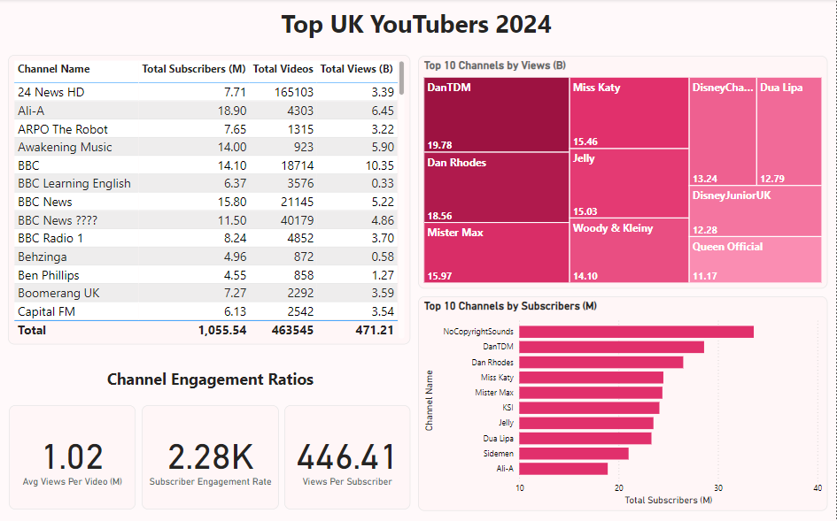

# Analyzing Data of **Top YouTubers In The UK** 2024


## Table of Content

- [Project Overview](#project-overview)
- [Data Source](#data-source)
- [Tools](#tools)
- [Stages for Analysis](#stages-for-analysis)
- [Design](#design)
- [Development](#development)
	- [Pseudocode](#pseudocode)
	- [Data Exploration Note](#data-exploration-note)
	- [Data Cleaning](#data-cleaning)
- [Testing](#testing)
- [Visualization](#visualization)
	- [Result](#result) 
	- [DAX Measures](#dax-measures)
- [Analysis](#analysis)
	- [Findings](#findings)
	- [Validation](#validation)
	- [Discovery](#discovery)
- [Recommendations](#recommendations)
	- [Potential ROI](#potential-roi)
	- [Potential Action Plan](#potential-action-plan)
- [Conclusion](#conclusion)


## **Project Overview**

- The pain point

The Head of marketing wants to find out who are the top YouTubers in the United Kingdon, as this will help the marketing team make informed decisions on which YouTuber will be best to run marketing campaign and partnerships with throughout the year.

- The ideal solution

To create a dashboard that provide insights into the top YouTubers in the United Kingdom. This dashboard should include:
1. Subscriber count
2. Total views
3. Total videos
4. Views engagement rate

These key metrics will help decide on which YouTuber to collaborate with to run marketing campaigns.


## **User Story**

As the Head of Marketing, I want to use a dashboard that analyses YouTube channel data in the United Kingdom.
This dashboard should allow me to identify the top performing channels based on metrics like subscriber base and average views.
With this information, I can make more informed decisions about which Youtubers are best to collaborate with, and therefore maximize how effective each marketing campaign is.


## **Data Source**

We need data of the top 100 YouTubers in the United Kingdom in 2024, that includes:

1. The channel names
2. Number of videos uploaded
3. Total subscribers
4. Total views

This data is sourced from Kaggle [Get it here!](https://www.kaggle.com/datasets/bhavyadhingra00020/top-100-social-media-influencers-2024-countrywise?resource=download)


## **Tools**


| Tools | Purpose |
| ----- | ------- |
| Excel | Exploring the data and testing |
| Sql Server | Cleaning, testing, and analyzing the data |
| Power BI | Visualing the data through interactive dashboard |
| GitHub | Hosting projects documentation and version control |


## **Stages for Analysis**

- Design
- Development
- Testing
- Visualization
- Analysis


## **Design**


### Dashboard Component Requirements

- First we firgured out what the dashboard should contain based on the requirements provided?
To understand what it should contain, we need to figure out what questions we need the dashboard to answer:

1. Who are the top 10 YouTubers with the most subscribers?
2. Which 3 channels have uploaded the most videos?
3. Which 3 channels have the most views?
4. Which 3 channels have the highest average views per video?
5. Which 3 channels have the highest views per subscriber ratio?
6. Which 3 channels have the highest subscriber engagement rate per video uploaded?

For now, these are some of the questions we need to answer, this may change as we progress down our analysis.


## **Development**


### Pseudocode 

- What's the general approach in creating this solution from start to finish?

1. Get the data
2. Explore the data in Excel
3. Load the data into SQL Server
4. Clean the data with SQL
5. Test the data with SQL
5. Visualize the data in Power BI
6. Generate the findings based on the insights
7. Write the documentation + commentary
8. Publish the data to GitHub Pages


### Data Exploration Note 

This is the stage where you have a scan of what's in the data, errors, inconcsistencies, bugs, weird and corrupted characters etc

- What are your initial observations with this dataset? What's caught your attention so far?

1. There are at least 4 columns that contain the data we need for this analysis, which signals we have everything we need from the file without needing to contact the client for any more data.

2. The first column contains the channel ID with what appears to be channel IDs, which are separated by a @ symbol - we need to extract the channel names from this.

3. Some of the cells and header names are in a different language - we need to confirm if these columns are needed, and if so, we need to address them.

4. We have more data than we need, so some of these columns would need to be removed.


### Data Cleaning 

1. What do we expect the clean data to look like? (What should it contain? What contraints should we apply to it?)
The aim is to refine our dataset to ensure it is structured and ready for analysis.

The cleaned data should meet the following criteria and constraints:

1. Only relevant columns should be retained.
2. All data types should be appropriate for the contents of each column.
3. No column should contain null values, indicating complete data for all records.

Below is a table outlining the constraints on our cleaned dataset:


| Property | Constraint |
| -------- | ---------- |
| Number of rows | 100 |
| Number of column | 4 |


And here is a tabular representation of the expected schema for the clean data:


| Column Name | Data Type | Nullable |
| ----------- | --------- | -------- |
| channel_name| VARCHAR | NO |
| total_subscribers | INT | NO |
| total_views | INT | NO |
| total_videos | INT | NO |


 What steps are needed to clean and shape the data into the desired format?
1. Remove unnecessary columns by only selecting the ones you need
2. Extract Youtube channel names from the first column
3. Rename columns using aliases


## **Testing**

What data quality and validation checks are we going to create?

Here are the SQL query data quality tests i conducted:

1. Row count check

```
/*
# Count the total number of records (or rows) are in the SQL view
*/
```
```SQL
SELECT
    COUNT(*) AS no_of_rows
FROM
    view_uk_youtubers_2024;
```

2. Column count check
```
/*
# Count the total number of columns (or fields) are in the SQL view
*/
```
```SQL
SELECT
    COUNT(*) AS column_count
FROM
    INFORMATION_SCHEMA.COLUMNS
WHERE
    TABLE_NAME = 'view_uk_youtubers_2024'
```

3. Data type check

```
/*
# Check the data types of each column from the view by checking the INFORMATION SCHEMA view
*/

-- 1.
SELECT
    COLUMN_NAME,
    DATA_TYPE
FROM
    INFORMATION_SCHEMA.COLUMNS
WHERE
    TABLE_NAME = 'view_uk_youtubers_2024';
```

4. Duplicate count check

```
/*
# 1. Check for duplicate rows in the view
# 2. Group by the channel name
# 3. Filter for groups with more than one row
*/

-- 1.
SELECT
    channel_name,
    COUNT(*) AS duplicate_count
FROM
    view_uk_youtubers_2024

-- 2.
GROUP BY
    channel_name

-- 3.
HAVING
    COUNT(*) > 1;
```


## **Visualization**


### Result

What the dashboard look like?




### Dax measures 

The Dax measures used to develop the dashboard

- Total Subscribers (M):

```
Total Subscribers (M) = 
VAR million = 1000000
VAR sumOfSubscribers = SUM(view_uk_youtubers_2024[total_subscribers])
VAR totalSubscribers = DIVIDE(sumOfSubscribers,million)

RETURN totalSubscribers
```

- Total Views (B):

```
Total Views (B) = 
VAR billion = 1000000000
VAR sumOfTotalViews = SUM(view_uk_youtubers_2024[total_views])
VAR totalViews = ROUND(sumOfTotalViews / billion, 2)

RETURN totalViews
```

- Total Videos:

```
Total Videos = 
VAR totalVideos = SUM(view_uk_youtubers_2024[total_videos])

RETURN totalVideos
```

- Average Views Per Video:

```
Average Views per Video (M) = 
VAR sumOfTotalViews = SUM(view_uk_youtubers_2024[total_views])
VAR sumOfTotalVideos = SUM(view_uk_youtubers_2024[total_videos])
VAR  avgViewsPerVideo = DIVIDE(sumOfTotalViews,sumOfTotalVideos, BLANK())
VAR finalAvgViewsPerVideo = DIVIDE(avgViewsPerVideo, 1000000, BLANK())

RETURN finalAvgViewsPerVideo 
```

- Subscribers Engagement Rate:

```
Subscriber Engagement Rate = 
VAR sumOfTotalSubscribers = SUM(view_uk_youtubers_2024[total_subscribers])
VAR sumOfTotalVideos = SUM(view_uk_youtubers_2024[total_videos])
VAR subscriberEngRate = DIVIDE(sumOfTotalSubscribers, sumOfTotalVideos, BLANK())

RETURN subscriberEngRate 
```

- Views Per Subscriber:

```
Views Per Subscriber = 
VAR sumOfTotalViews = SUM(view_uk_youtubers_2024[total_views])
VAR sumOfTotalSubscribers = SUM(view_uk_youtubers_2024[total_subscribers])
VAR viewsPerSubscriber = DIVIDE(sumOfTotalViews, sumOfTotalSubscribers, BLANK())

RETURN viewsPerSubscriber 
```


## **Analysis**

### Findings

For this analysis we focused on these questions written below in other to get the information we need for our marketing client

Here are the key questions we need to answer for our marketing client:

1. Who are the top 10 YouTubers with the most subscribers?
2. Which 3 channels have uploaded the most videos?
3. Which 3 channels have the most views?
4. Which 3 channels have the highest average views per video?
5. Which 3 channels have the highest views per subscriber ratio?
6. Which 3 channels have the highest subscriber engagement rate per video uploaded?

---

Question 1: Who are the top 10 YouTubers with the most subscribers?

| Rank | Channel Name | Subscribers (M) |
| ---- | ------------ | ----------- |
| 1 | NoCopyrightSounds | 33.60 |
| 2 | DanTDM | 28.60 |
| 3 | Dan Rhodes | 26.50 |
| 4 | Miss Katy | 24.50 |
| 5 | Mister Max | 24.40 |
| 6 | KSI | 24.10 |
| 7 | Jelly | 23.50 |
| 8 | Dua Lipa | 23.30 |
| 9 | Sidemen | 21.00 |
| 10 | Ali-A | 18.90 |


Question 2: Which 3 channels have uploaded the most videos?

| Rank | Chennel Name | Video Upload |
| ---- | ------------ | ------------ |
| 1 | GRM Daily | 14,696 |
| 2 | Manchester City | 8,248 |
| 3 | Yogscast | 6,435 |


Question 3: Which 3 channels have the most views?

| Rank | Channel Name | Total Views (B) |
| ---- | ------------ | --------------- |
| 1 | DanTDM | 19.78 |
| 2 | Dan Rhodes | 18.56 |
| 3 | Mister Max | 15.97 |


Question 4: Which 3 channels have the highest average views per video?

| Rank | Channel Name | Avg Views Per Video (M) |
| ---- | ------------ | ------------------- |
| 1 | Mark Ronson | 32.27 |
| 2 | Jessie J | 5.97 |
| 3 | Dua Lipa | 5.76 |


Question 5: Which 3 channels have the highest views per subscriber ratio?

| Rank | Channel Name | Views Per Subscriber |
| ---- | ------------ | -------------------- |
| 1 | GRM Daily | 1185.79 |
| 2 | Nickelodeon | 1061.04 |
| 3 | Disney Junior UK | 1031.97 |


Question 6: Which 3 channels have the highest subscriber engagement rate per video uploaded?

| Rank | Channel Name | Subscriber Engagemnt Rate |
| ---- | ------------ | ------------------------- |
| 1 | Mark Ronson | 343,000 |
| 2 | Jessie J | 110,416.67 |
| 3 | Dua Lipa | 104,954.95 |

#### Notes
For this analysis, we'll prioritize analysing the metrics that are important in generating the expected ROI for our marketing client, which are the YouTube channels with the most:

- subscribers
- total views
- videos uploaded


### Validation 


#### 1. YouTubers with the most subscribers

#### Calculation Breakdown

Canpaign Idea = Product placement

a. NoCopyrightSounds

- Average views per video = 6.92 million
- Product cost = $5
- Potential units sold per video = 6.92 million x 2% conversion rate = 138,400 units sold
- Potential revenue per video = 138,400 x $5 = $692,000
- Campaign cost (one-time fee) = $50,000
- Net profit = $692,000 - $50,000 = $642,000

b. DanTDM

- Average views per video = 5.34 million
- Product cost = $5
- Potential units sold per video = 5.34 million x 2% conversion rate = 106,800 units sold
- Potential revenue per video = 106,800 x $5 = $534,000
- Campaign cost (one-time fee) = $50,000
- Net profit = $534,000 - $50,000 = $484,000

c. Dan Rhodes 

- Average views per video = 11.15 million
- Product cost = $5
- Potential units sold per video = 11.15 million x 2% conversion rate = 223,000 units sold
- Potential revenue per video = 223,000 x $5 = $1,115,000
- Campaign cost (one-time fee) = $50,000
- Net profit = $1,115,000 - $50,000 = $1,065,000

The Best option from category is: Dan Rhodes


#### SQL Query
```
/* 

# 1. Define variables 
# 2. Create a CTE that rounds the average views per video 
# 3. Select the column you need and create calculated columns from existing ones 
# 4. Filter results by Youtube channels
# 5. Sort results by net profits (from highest to lowest)

*/

-- 1. 
DECLARE @conversionRate FLOAT = 0.02;		-- The conversion rate @ 2%
DECLARE @productCost FLOAT = 5.0;			-- The product cost @ $5
DECLARE @campaignCost FLOAT = 50000.0;		-- The campaign cost @ $50,000	

-- 2.  
WITH ChannelData AS (
    SELECT 
        channel_name,
        total_views,
        total_videos,
        ROUND((CAST(total_views AS FLOAT) / total_videos), -4) AS rounded_avg_views_per_video
    FROM 
        youtube_db.dbo.view_uk_youtubers_2024
)

-- 3. 
SELECT 
    channel_name,
    rounded_avg_views_per_video,
    (rounded_avg_views_per_video * @conversionRate) AS potential_units_sold_per_video,
    (rounded_avg_views_per_video * @conversionRate * @productCost) AS potential_revenue_per_video,
    ((rounded_avg_views_per_video * @conversionRate * @productCost) - @campaignCost) AS net_profit
FROM 
    ChannelData

-- 4. 
WHERE 
    channel_name in ('NoCopyrightSounds', 'DanTDM', 'Dan Rhodes')    

-- 5.  
ORDER BY
	net_profit DESC

```


### 2. YouTuber with the most video uploaded

#### Calculation breakdown

Campaign idea = sponsored video series

a. GRM Daily

- Average views per video = 510,000
- Product cost = $5
- Potential units sold per video = 510,000 x 2% conversion rate = 10,200 units sold
- Potential revenue per video = 10,200 x $5= $51,000
- Campaign cost (11-videos @ $5,000 each) = $55,000
- Net profit = $51,000 - $55,000 = -$4,000 (potential loss)

b. Manchester City

- Average views per video = 240,000
- Product cost = $5
- Potential units sold per video = 240,000 x 2% conversion rate = 4,800 units sold
- Potential revenue per video = 4,800 x $5= $24,000
- Campaign cost (11-videos @ $5,000 each) = $55,000
- Net profit = $24,000 - $55,000 = -$31,000 (potential loss)

c. Yogscast

- Average views per video = 710,000
- Product cost = $5
- Potential units sold per video = 710,000 x 2% conversion rate = 14,200 units sold
- Potential revenue per video = 14,200 x $5= $71,000
- Campaign cost (11-videos @ $5,000 each) = $55,000
- Net profit = $71,000 - $55,000 = $16,000 (profit)

Best option from category: Yogscast

#### SQL Query

```
/* 
# 1. Define variables
# 2. Create a CTE that rounds the average views per video
# 3. Select the columns you need and create calculated columns from existing ones
# 4. Filter results by YouTube channels
# 5. Sort results by net profits (from highest to lowest)
*/

-- 1.
DECLARE @conversionRate FLOAT = 0.02;           -- The conversion rate @ 2%
DECLARE @productCost FLOAT = 5.0;               -- The product cost @ $5
DECLARE @campaignCostPerVideo FLOAT = 5000.0;   -- The campaign cost per video @ $5,000
DECLARE @numberOfVideos INT = 11;               -- The number of videos (11)

-- 2.
WITH ChannelData AS (
    SELECT
        channel_name,
        total_views,
        total_videos,
        ROUND((CAST(total_views AS FLOAT) / total_videos), -4) AS rounded_avg_views_per_video
    FROM
        youtube_db.dbo.view_uk_youtubers_2024
)

-- 3.
SELECT
    channel_name,
    rounded_avg_views_per_video,
    (rounded_avg_views_per_video * @conversionRate) AS potential_units_sold_per_video,
    (rounded_avg_views_per_video * @conversionRate * @productCost) AS potential_revenue_per_video,
    ((rounded_avg_views_per_video * @conversionRate * @productCost) - (@campaignCostPerVideo * @numberOfVideos)) AS net_profit
FROM
    ChannelData

-- 4.
WHERE
    channel_name IN ('GRM Daily', 'Man City', 'YOGSCAST Lewis & Simon ')

-- 5.
ORDER BY
    net_profit DESC;
```


### 3. Youubers with the most views

#### Calculation breakdown

Campaign idea = Influencer marketing

a. DanTDM

- Average views per video = 5.34 million
- Product cost = $5
- Potential units sold per video = 5.34 million x 2% conversion rate = 106,800 units sold
- Potential revenue per video = 106,800 x $5 = $534,000
- Campaign cost (3-month contract) = $130,000
- Net profit = $534,000 - $130,000 = $404,000

b. Dan Rhodes

- Average views per video = 11.15 million
- Product cost = $5
- Potential units sold per video = 11.15 million x 2% conversion rate = 223,000 units sold
- Potential revenue per video = 223,000 x $5 = $1,115,000
- Campaign cost (3-month contract) = $130,000
- Net profit = $1,115,000 - $130,000 = $985,000

c. Mister Max

- Average views per video = 14.06 million
- Product cost = $5
- Potential units sold per video = 14.06 million x 2% conversion rate = 281,200 units sold
- Potential revenue per video = 281,200 x $5 = $1,406,000
- Campaign cost (3-month contract) = $130,000
- Net profit = $1,406,000 - $130,000 = $1,276,000

Best option from category: Mister Max

#### SQL Query 

```
/*
# 1. Define variables
# 2. Create a CTE that rounds the average views per video
# 3. Select the columns you need and create calculated columns from existing ones
# 4. Filter results by YouTube channels
# 5. Sort results by net profits (from highest to lowest)
*/


-- 1.
DECLARE @conversionRate FLOAT = 0.02;        -- The conversion rate @ 2%
DECLARE @productCost MONEY = 5.0;            -- The product cost @ $5
DECLARE @campaignCost MONEY = 130000.0;      -- The campaign cost @ $130,000

-- 2.
WITH ChannelData AS (
    SELECT
        channel_name,
        total_views,
        total_videos,
        ROUND(CAST(total_views AS FLOAT) / total_videos, -4) AS avg_views_per_video
    FROM
        youtube_db.dbo.view_uk_youtubers_2024
)

-- 3.
SELECT
    channel_name,
    avg_views_per_video,
    (avg_views_per_video * @conversionRate) AS potential_units_sold_per_video,
    (avg_views_per_video * @conversionRate * @productCost) AS potential_revenue_per_video,
    (avg_views_per_video * @conversionRate * @productCost) - @campaignCost AS net_profit
FROM
    ChannelData

-- 4.
WHERE
    channel_name IN ('Mister Max', 'DanTDM', 'Dan Rhodes')

-- 5.
ORDER BY
    net_profit DESC;

```


### Discovery 

- What did we learn?

1. NoCopyrightSOunds, Dan Rhodes and DanTDM are the channnels with the most subscribers in the UK
2. GRM Daily, Man City and Yogscast are the channels with the most videos uploaded
3. DanTDM, Dan RHodes and Mister Max are the channels with the most views
4. Entertainment channels are useful for broader reach, as the channels posting consistently on their platforms and generating the most engagement are focus on entertainment and music


## Recommendations

- What do you recommend based on the insight gathered?

1. Dan Rhodes is the best YouTube channel to collaborate with if we want to maximize visbility because this channel has the most YouTube subscribers in the UK
2. Although GRM Daily, Man City and Yogcasts are regular publishers on YouTube, it may be worth considering whether collaborating with them with the current budget caps are worth the effort, as the potential return on investments is significantly lower compared to the other channels.
3. Mister Max is the best YouTuber to collaborate with if we're interested in maximizing reach, but collaborating with DanTDM and Dan Rhodes may be better long-term options considering the fact that they both have large subscriber bases and are averaging significantly high number of views.
4. The top 3 channels to form collaborations with are NoCopyrightSounds, DanTDM and Dan Rhodes based on this analysis, because they attract the most engagement on their channels consistently.


### Potential ROI

What ROI do we expect if we decide to go with this channels?

1. Setting up a collaboration deal with Dan Rhodes would potentially make the client a net profit of $1,065,000 per video
2. An influencer marketing contract with Mister Max can see the client generate a net profit of $1,276,000
3. If we go with a product placement campaign with DanTDM, this could generate the client approximately $484,000 per video. If we advance with an influencer marketing campaign deal instead, this would make the client a one-off net profit of $404,000.
4. NoCopyrightSounds could profit the client $642,000 per video too (which is worth considering)


### Potential Action Plan

- What course of action should be taken and why?

Based on our analysis, we believe the best channel to advance a long-term partnership deal with to promote the client's products is Dan Rhodes channel.

We'll have conversations with the marketing client to forecast what they also expect from this collaboration. Once we observe we're hitting the expected milestones, we'll advance with potential partnerships with DanTDM, Mister Max and NoCopyrightSounds channels in the future.


## Conclusion

- What steps do we take to implement the recommended decisions effectively?

1. Reach out to the teams behind each of these channels, starting with Dan Rhodes
2. Negotiate contracts within the budgets allocated to each marketing campaign
3. Kick off the campaigns and track each of their performances against the KPIs
4. Review how the campaigns have gone, gather insights and optimize based on feedback from converted customers and each channel's audiences


